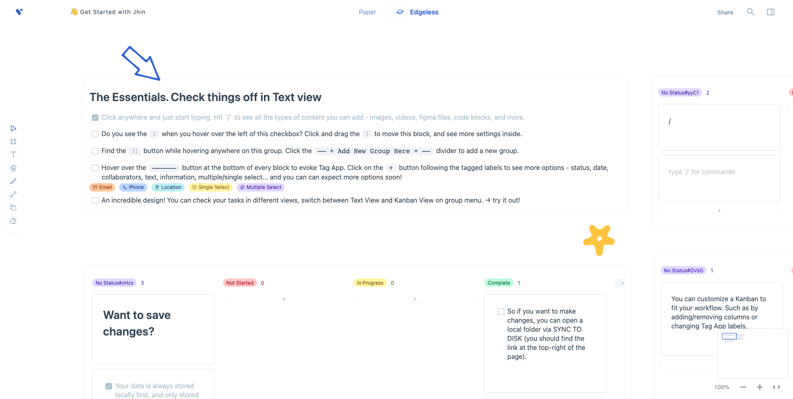

    
     
    <small>The Next-Gen Collaborative Knowledge Base</small>

# Jhin

Open-source and privacy-first. A free replacement for Notion & Miro.

## Getting Started

Want to deploy it yourself? Jhin can run just about anywhere.  

[Jhin Documentation](https://docs.affine.pro/affine/) - More detailed documentation on how to use and develop with Jhin

⚠️ Please note that Jhin is still under active development and is not yet ready for production use. ⚠️

## Create your story

There can be more than Notion and Miro. Jhin is a next-gen knowledge base that brings planning, sorting and creating all together. Privacy first, open-source, customizable and ready to use, built with web technologies to ensure consistency and accessibility on Mac, Windows and Linux. We want your data always to be yours, without any sacrifice to your accessibility. Your data is always stored local first, with full support for real-time collaboration through peer-to-peer technology. We don't think "privacy-first" is a good excuse for not supporting modern web features.
And when it comes to collaboration, these features are not just necessarily for teams - you can take and insert pictures on your phone, edit them from your desktop, and then share them with your collaborators.

## Contact Us

Feel free to send us an email: bqjimaster@gmail.com

## The Philosophy of Jhin

Timothy Berners-Lee once taught us about the idea of the semantic web, where all the data can be interpreted in any form while the "truth" is kept. This gives our best image of an ideal knowledge base by far, that sorting of information, planning of project and goals as well as creating of knowledge can be all together.
We have witnessed waves of paradigm shift so many times. At first, everything was noted on office-like apps or DSL like LaTeX, then we found todo-list apps and WYSIWYG markdown editors better for writing and planning. Finally, here comes Notion and Miro, who take advantage of the idea of blocks to further liberate our creativity.
It is all perfect... without waste operations and redundant information. And, we insist that privacy first should always be given by default.
That's why we are making Jhin. Some of the most important features are:

-   Transformable
    -   Every block can be transformed equally
        -   e.g. you can create a todo in Markdown in the text view and then later edit it in the kanban view.
    -   Every document can be turned into a whiteboard
        -   An always good-to-read, structured docs-form page is the best for your notes, but a boundless doodle surface is better for collaboration and creativity.
-   Atomic
    -   The basic elements of AFFiNE are blocks, not pages.
        -   Blocks can be directly reused and synced between pages.
    -   Pages and blocks are searched and organized based on connected graphs, not tree-like paths.
    -   Dual-link and semantic search are fully supported.
-   Collaborative and privacy-first
    -   Data is always stored locally by default
    -   CRDTs are applied so that peer-to-peer collaboration is possible.

We appreciate the ideas of Monday, Airtable, and Notion databases. They have inspired us and shaped our product, helping us get it right when it comes to task management. But we also do things differently. We don't like doing things again and again. It's easy to set a todo with Markdown, but then why do you need to repeat and recreate data for a kanban or other databases. This is the power of AFFiNE. With AFFiNE, every block group has infinite views, for you to keep your single source of data, a single source of truth.

We would like to give special thanks to the innovators and pioneers who greatly inspired us:

-   Quip & Notion -- that docs can be organized as blocks
-   Taskade & Monday -- brilliant multi-dimensional tables
-   Height & Linear -- beautiful task management tool

We would also like to give thanks to open-source projects that make affine possible:

-   [Yjs](https://github.com/yjs/yjs) & [Yrs](https://github.com/y-crdt/y-crdt) -- Fundamental support of CRDTs for our implementation on state management and data sync.
-   [React](https://github.com/facebook/react) -- View layer support and web GUI framework.
-   [Rust](https://github.com/rust-lang/rust) -- High performance language that extends the ability and availability of our real-time backend, JWST.
-   [Fossil](https://www2.fossil-scm.org/home/doc/trunk/www/index.wiki) -- Source code management tool made with CRDTs which inspired our design on block data structure.
-   [slatejs](https://github.com/ianstormtaylor/slate) -- Customizable rich-text editor.
-   [Jotai](https://github.com/pmndrs/jotai) -- Minimal state management tool for frontend.
-   [Tldraw](https://github.com/tldraw/tldraw) -- Excellent drawing board.
-   [MUI](https://github.com/mui/material-ui) -- Our most used graphic UI component library.
-   Other [dependencies](https://github.com/toeverything/AFFiNE/network/dependencies)

We use the following open source projects to help us build a better development experience:

-   [nx](https://github.com/nrwl/nx) -- Awesome monorepo manager & build system
-   [tolgee](https://github.com/tolgee/tolgee-platform) -- Elegant i18n collaborative editing platform

Thanks a lot to the community for providing such powerful and simple libraries, so that we can focus more on the implementation of the product logic, and we hope that in the future our projects will also provide a more easy-to-use knowledge base for everyone.

[Some amazing companies](./docs/jobs/summary.md), including AFFiNE are looking for developers! Are you interested in helping build with AFFiNE and/or its partners? Check out some of the latest [jobs available](./docs/jobs/summary.md).

## License

Jhin is distributed under the terms of MIT license.

See [LICENSE](/LICENSE) for details.
